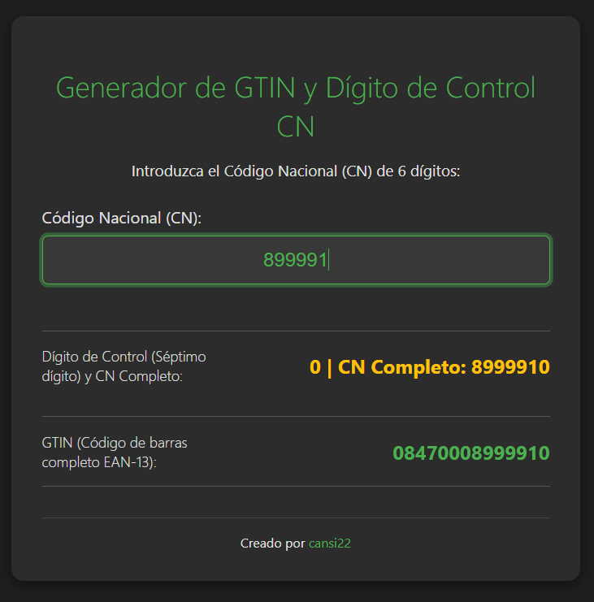

# 🇪🇸 Generador de GTIN y Dígito de Control para Código Nacional (CN) de Medicamentos

Herramienta web sencilla, alojada en GitHub Pages, diseñada para calcular y validar los códigos de control del sector farmacéutico español a partir de un Código Nacional (CN) base.

WEB: (https://cansi22.github.io/generador-CN-farmacia/)
---

## 💡 Características

Esta utilidad calcula dos elementos clave, asumiendo un CN base de **6 dígitos**:

1.  **Dígito de Control CN (Séptimo Dígito):** El dígito de control interno del Código Nacional, utilizando la fórmula específica del sector farmacéutico español.
2.  **GTIN (EAN-13):** El código de barras completo de 13 dígitos, siguiendo la estructura oficial para medicamentos: `84 (España) + 7000 (Farmacia) + CN (6 dígitos) + DC (Dígito de Control EAN-13)`.

---

## 🛠️ Uso

Simplemente introduce el **CN base de 6 dígitos** en el campo de texto. Los resultados se actualizarán automáticamente.
Aquí puedes ver una captura de pantalla de la herramienta en funcionamiento:

### Estructura de Códigos Generados

| Código Generado | Base de Cálculo | Ejemplo (CN Base: 123456) |
| :--- | :--- | :--- |
| **CN de 7 dígitos** | CN Base + DC Interno | `123456X` (Donde X es el DC Interno) |
| **GTIN (EAN-13)** | `847000` + CN Base + DC EAN-13 | `847000123456Y` (Donde Y es el DC EAN-13) |

---

## 🏗️ Tecnología

El proyecto es una "mini-web" simple construida con:

* **HTML5:** Estructura de la interfaz.
* **CSS3:** Estilos con un tema oscuro (`styles.css`).
* **JavaScript:** Lógica de cálculo para las fórmulas de los dígitos de control (`script.js`).

---

## 🧑‍💻 Autor

Este proyecto ha sido creado por:

* **[cansi22](https://github.com/cansi22)**
